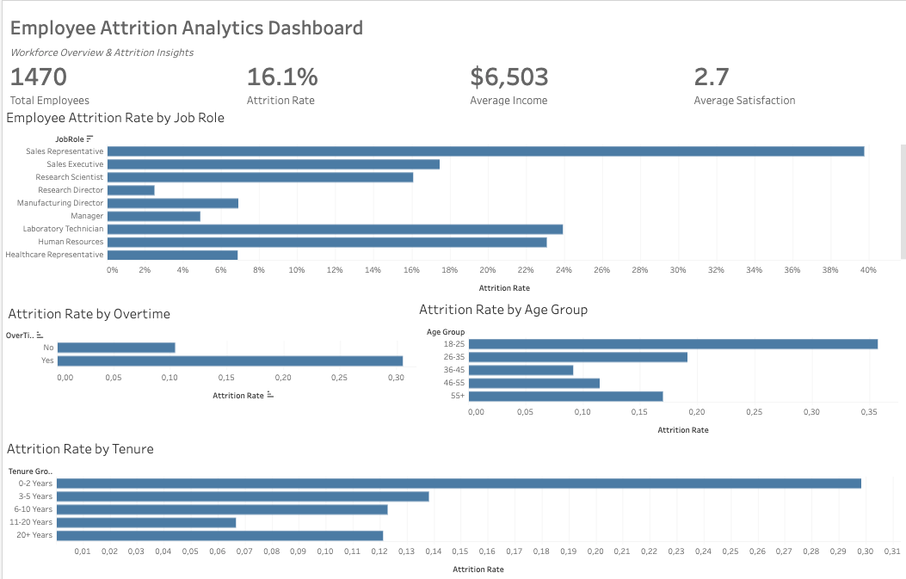

# 📊 Employee Attrition Analytics Dashboard



An end-to-end HR Analytics project built with **Python** and **Tableau Public** to explore employee attrition patterns, identify workforce trends, and present actionable business insights through an interactive dashboard.

---

## 📌 Project Overview

Employee attrition is a major challenge for organizations because it impacts productivity, recruitment costs, and workforce stability.

This project analyzes employee attrition using the IBM HR Analytics Employee Attrition dataset. The workflow includes data cleaning, feature engineering, exploratory data analysis (EDA), and dashboard development to answer key HR business questions.

---

## 🎯 Business Questions

This project aims to answer the following questions:

- What is the overall employee attrition rate?
- Which departments experience the highest attrition?
- Does overtime influence employee turnover?
- How does attrition differ across age groups?
- Which job roles have the highest attrition?
- Is monthly income associated with employee attrition?
- How does employee tenure affect attrition?

---

## 🛠️ Tools & Technologies

- Python
- Pandas
- NumPy
- Matplotlib
- Jupyter Notebook
- Tableau Public

---

## 📂 Project Workflow

- Data Cleaning
- Feature Engineering
- Exploratory Data Analysis (EDA)
- Business Insights
- Interactive Dashboard Development

---

## 📊 Dashboard

**Interactive Tableau Dashboard**

🔗 https://public.tableau.com/views/EmployeeAttritionAnalyticsDashboard/Dashboard1?:language=en-US&:sid=&:redirect=auth&:display_count=n&:origin=viz_share_link

---

## 📈 Key Insights

- Overall employee attrition rate is **16.1%**.
- Employees working overtime are significantly more likely to leave the company.
- Sales Representatives have the highest attrition rate among all job roles.
- Employees with shorter tenure exhibit substantially higher turnover.
- Younger employees (18–25 years) experience the highest attrition compared to other age groups.

---

## 📁 Repository Structure

```text
employee-attrition-dashboard/
│
├── data/
│   └── employee_attrition_clean.csv
│
├── notebooks/
│   └── employee_attrition_analysis.ipynb
│
├── tableau/
│   └── Employee_Attrition_Analytics_Dashboard.twbx
│
├── images/
│   └── dashboard.png
│
└── README.md
```

---

## 🚀 Skills Demonstrated

- Data Cleaning
- Exploratory Data Analysis (EDA)
- Feature Engineering
- Business Analytics
- Data Visualization
- Dashboard Design
- HR Analytics
- Python
- Tableau

---

## 👤 Author

**Sude Celasun**

M.Sc. Data Science  
TU Dortmund University

